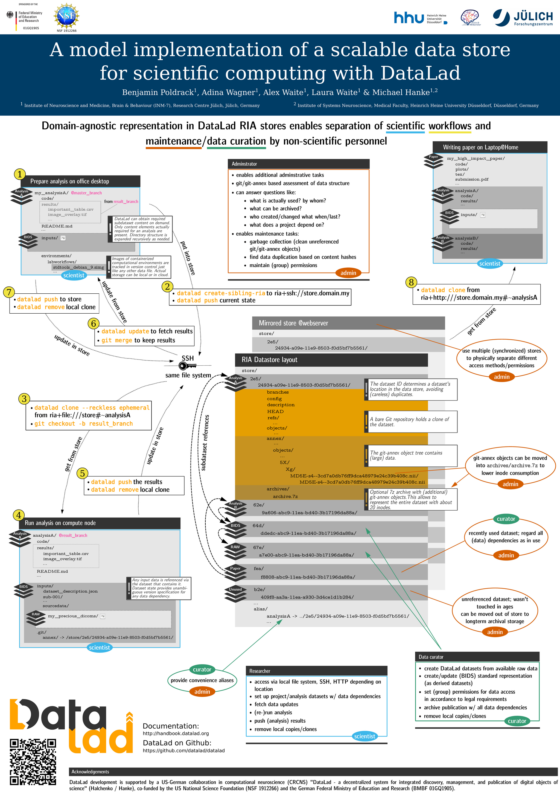

# RIA-Stores

## What is a RIA-store?

Essentially, a RIA-store is a **r**eally **i**nteresting **a**rchitecture for a
place to provide a collection of datasets from, where the location for any
particular dataset can be derived from its dataset ID. This conceptually results
in a flat list of datasets even if datasets reference various, possibly 
overlapping subsets of other datasets as subdatasets. The store can hold the
datasets themselves as bare repositories and/or their annexed file content in 
different forms. 
DataLad supports the use of [RIA-URL (TODO: link)]() to address
datasets in such a store, enabling a user to effectively only point to a store
and let DataLad to the rest. DataLad's builtin support for RIA stores currently
includes the commands [clone (TODO: link)](), [create-sibling-ria (TODO: link)](), and 
[export-archive-ora (TODO: link)](), and the [ORA special remote (TODO: link)]().

TODO:
- easy maintenance tasks (link to scripts)
- configurable layout
- ephemeral clones (dirhashmmixed and lower)
- other clonne features (reconfigure, publish-depends)
- special remote + archive

From clone:

    Primary differences over a direct `git clone` call are 1) the automatic
    initialization of a dataset annex (pure Git repositories are equally
    supported); 2) automatic registration of the newly obtained dataset as a
    subdataset (submodule), if a parent dataset is specified; 3) support
    for additional resource identifiers (DataLad resource identifiers as used
    on datasets.datalad.org, and RIA store URLs as used for store.datalad.org
    - optionally in specific versions as identified by a branch or a tag; see
    examples); and 4) automatic configurable generation of alternative access
    URL for common cases (such as appending '.git' to the URL in case the
    accessing the base URL failed).

    In case the clone is registered as a subdataset, the original URL passed to
    `clone` is recorded in `.gitmodules` of the parent dataset in addition
    to the resolved URL used internally for git-clone. This allows to preserve
    datalad specific URLs like ria+ssh://... for subsequent calls to `get` if
    the subdataset was locally removed later on.

    + postclone_preannex_cfg_ria
    + postclonecfg_ria

From create-sibling-ria

    Communication with a dataset in a RIA store is implemented via two
    siblings. A regular Git remote (repository sibling) and a git-annex
    special remote for data transfer (storage sibling) -- with the former
    having a publication dependency on the latter. By default, the name of the
    storage sibling is derived from the repository sibling's name by appending
    "-storage".

    The store's base path is expected to not exist, be an empty directory,
    or a valid RIA store.

    RIA store layout
    ~~~~~~~~~~~~~~~~

    A RIA store is a directory tree with a dedicated subdirectory for each
    dataset in the store. The subdirectory name is constructed from the
    DataLad dataset ID, e.g. '124/68afe-59ec-11ea-93d7-f0d5bf7b5561', where
    the first three characters of the ID are used for an intermediate
    subdirectory in order to mitigate files system limitations for stores
    containing a large number of datasets.

    Each dataset subdirectory contains a standard bare Git repository for
    the dataset.

    In addition, a subdirectory 'annex' hold a standard Git-annex object
    store. However, instead of using the 'dirhashlower' naming scheme for
    the object directories, like Git-annex would do, a 'dirhashmixed'
    layout is used -- the same as for non-bare Git repositories or regular
    DataLad datasets.

    Optionally, there can be a further subdirectory 'archives' with
    (compressed) 7z archives of annex objects. The storage remote is able to
    pull annex objects from these archives, if it cannot find in the regular
    annex object store. This feature can be useful for storing large
    collections of rarely changing data on systems that limit the number of
    files that can be stored.

    Each dataset directory also contains a 'ria-layout-version' file that
    identifies the data organization (as, for example, described above).

    Lastly, there is a global 'ria-layout-version' file at the store's
    base path that identifies where dataset subdirectories themselves are
    located. At present, this file must contain a single line stating the
    version (currently "1"). This line MUST end with a newline character.

    It is possible to define an alias for an individual dataset in a store by
    placing a symlink to the dataset location into an 'alias/' directory
    in the root of the store. This enables dataset access via URLs of format:
    'ria+<protocol>://<storelocation>#~<aliasname>'.

    Error logging
    ~~~~~~~~~~~~~

    To enable error logging at the remote end, append a pipe symbol and an "l"
    to the version number in ria-layout-version (like so '1|l\\n').

    Error logging will create files in an "error_log" directory whenever the
    git-annex special remote (storage sibling) raises an exception, storing the
    Python traceback of it. The logfiles are named according to the scheme
    '<dataset id>.<annex uuid of the remote>.log' showing "who" ran into this
    issue with which dataset. Because logging can potentially leak personal
    data (like local file paths for example), it can be disabled client-side
    by setting the configuration variable
    "annex.ora-remote.<storage-sibling-name>.ignore-remote-config".
